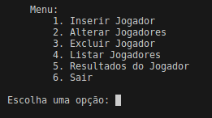

# FutDev
Esse código JavaScript implementa um sistema de gerenciamento de jogadores de futebol através de um terminal interativo.

## Módulo readline
**readline** : Permite a leitura de entradas do usuário no terminal.
**readline.createInterface** cria uma interface para leitura que usa **process.stdin** para ler dados do usuário e process.stdout para exibir mensagens.

```javascript
const readline = require('readline');

const rl = readline.createInterface({

    input: process.stdin,

    output: process.stdout
});
```
## Array 
Iniciamos um array de objetos "jogadores" representando cada jogador. No exemplo, há apenas um jogador inicial, com algumas informações.

```javascript
let jogadores = [

    { nome: "Messi", idade: 37, posicao: "Atacante", numeroCamisa: 10, equipe: "Inter Miami", vitorias: 700, derrotas: 300 },
];
```

## Funções
- `exibirMenu`

Mostra as opções disponíveis e aguarda a escolha do usuário. Dependendo da opção escolhida, chama outras funções específicas ou fecha o programa.

```javascript
function exibirMenu() {

    console.log(`
    Menu:
        1. Inserir Jogador
        2. Alterar Jogadores
        3. Excluir Jogador  
        4. Listar Jogadores
        5. Resultados do Jogador
        6. Sair
    `);

    rl.question('Escolha uma opção: ', (opcao) => {
        switch (opcao) {
            case '1':
                inserirJogadores();
                break;
            case '2':
                alterarJogador();
                break;
            case '3':
                excluirJogador();
                break;
            case '4':
                listarJogadores();
                break;
            case '5':
                resultadosDoJogador();
                break;
            case '6':
                console.log('Sair');
                rl.close();
                break;
            default:
                console.log('Opção inválida, tente novamente.');
                exibirMenu();
                break;
        }
    });
}    
```

- `verificarNumeroCamisa`

Verifica se já existe um jogador com o mesmo número de camisa em uma equipe específica.

```javascript
function verificarNumeroCamisa(numeroCamisa, equipe) {

    return jogadores.some(jogador => jogador.numeroCamisa == numeroCamisa &&
jogador.equipe == equipe);
}
```
- `inserirJogador`

Adiciona um novo jogador ao array jogadores, coletando as informações necessárias do usuário pelo terminal.

```javascript
function inserirJogadores() {
    rl.question('Digite o nome do jogador: ', (nome) => {
        rl.question('Digite a idade do jogador: ', (idade) => {
            rl.question('Digite a posição do jogador: ', (posicao) => {
                rl.question('Digite o número da camisa do jogador: ', (numeroCamisa) => {
                    rl.question('Digite o nome da equipe do jogador: ', (equipe) => {                      
                        if (verificarNumeroCamisa(numeroCamisa, equipe)) {
                            console.log('Erro: Já existe um jogador com o mesmo número de camisa nesta equipe.');
                            exibirMenu();
                        } else {
                            rl.question('Digite o numero de vitórias do jogador: ', (vitorias) => {
                                rl.question('Digite o numero de derrotas do jogador: ', (derrotas) => {
                                    jogadores.push({ nome: nome, idade: idade, posicao: posicao, numeroCamisa:numeroCamisa, equipe: equipe, vitorias: vitorias, derrotas: derrotas });
                                    console.log('Jogador cadastrado com sucesso!');
                                    exibirMenu();
                                });
                            });
                        }
                    });
                });
            });
        });
    });
}
```
- `alterarJogador`

Permite ao usuário alterar as informações de um jogador existente.

```javascript
function alterarJogador() {
    rl.question('Digite o número que deseja editar: ', (numero) => {
        if (numero > 0 && numero <= jogadores.length) {
            rl.question('Digite o novo nome do Jogador: ', (novoNome) => {
                rl.question('Digite a nova idade do Jogador: ', (novaIdade) => {
                    rl.question('Digite a nova posição do jogador: ', (novaPosicao) => {
                        rl.question('Digite o novo número da camisa do jogador: ', (novoNumeroCamisa) => {
                            rl.question('Digite a nova equipe do jogador: ', (novaEquipe) => {
                                rl.question('Digite o novo número de vitórias: ', (novasVitorias) => {
                                    rl.question('Digite o novo número de derrotas ', (novasDerrotas) => {
                                    jogadores[numero - 1] = {
                                    nome: novoNome,
                                    idade: novaIdade,
                                    posicao: novaPosicao,
                                    numeroCamisa: novoNumeroCamisa,
                                    equipe: novaEquipe,
                                    vitorias: novasVitorias,
                                    derrotas: novasDerrotas,
                                };
                                console.log('Jogador alterado com sucesso!');
                                exibirMenu();
                                  });
                               });
                            });
                        });
                    });
                });
            });
        } else {
            console.log('Número inválido, tente novamente.');
            exibirMenu();
        }
    });
}
```
- `excluirJogador`

Exclui um jogador do array jogadores com base no número fornecido pelo usuário.

```javascript
function excluirJogador() {
    rl.question('Digite o número que deseja excluir: ', (numero) => {
        if (numero > 0 && numero <= jogadores.length) {
            jogadores.splice(numero - 1, 1);
            console.log('Jogador excluído com sucesso!');
            exibirMenu();
        } else {
            console.log('Número inválido, tente novamente.');
            exibirMenu();
        }
    });
}
```
- `listarJogadores`

Exibe todos os jogadores cadastrados no formato específico.

```javascript
function listarJogadores() {
    if (jogadores.length === 0) {
        console.log('Nenhum jogador cadastrado');
    } else {
        console.log('Lista de jogadores cadastrados:');
        jogadores.forEach((jogador, index) => {
            console.log(`[${index + 1}] Nome: ${jogador.nome}, Idade: ${jogador.idade}, Posição: ${jogador.posicao}, Número: ${jogador.numeroCamisa}, Equipe: ${jogador.equipe}, Vitórias: ${jogador.vitorias}, Derrotas: ${jogador.derrotas}`);
        });
    }
    exibirMenu();
}
```
- `resultadosDoJogador`

Mostra os resultados (vitórias e derrotas) de um jogador com base no número escolhido.

```javascript
function resultadosDoJogador() {
    rl.question('Digite o número do jogador para ver os resultados: ', (numero) => {
        if (numero > 0 && numero <= jogadores.length) {
            const jogador = jogadores[numero - 1];
            console.log(`Resultados para o jogador ${jogador.nome}:`);
            console.log(`Vitórias: ${jogador.vitorias}`);
            console.log(`Derrotas: ${jogador.derrotas}`);
        } else {
            console.log('Número de jogador inválido, tente novamente.');
        }
        exibirMenu();
    });
}
```


## Exemplo do menu no terminal


